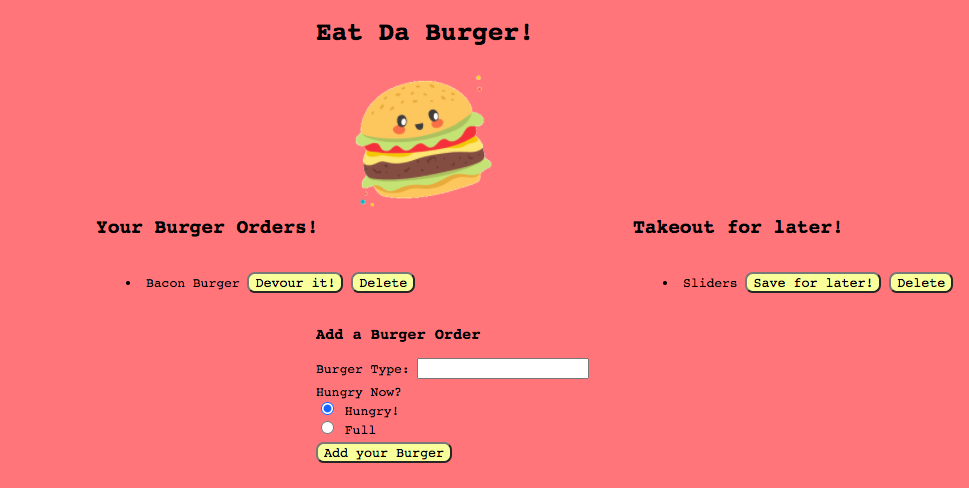

# Eat-Da-Burger

## Table of Contents
* [License](#license)
* [Description](#description)
* [URL](#url)
* [Installation](#installation)
* [Usage](#usage)
* [Tests](#tests)
* [Questions](#questions)

## Description 
The 'Eat Da Burger' wesbsite is an open source for users to quickly and easily add their burger orders to the webpage and then can decide to eat their order now or save it for later by clicking a button. If the user decides they do not want the burger, they can delete it!

## URL
[Click here to see the live website!]()

## Installation
npm i, npm i inquirer, npm i express, npm i express-handlebars, npm init

## Usage
'Eat Da Burger' is a open source for users to create burger orders and decide when they would like to eat it.

## Tests
No tests are necessary to run this application.

## Questions
Please contact me below with any questions you have about the appiction.
* Github: https://github.com/margaretelson
* Email: margaret.a.elson@gmail.com